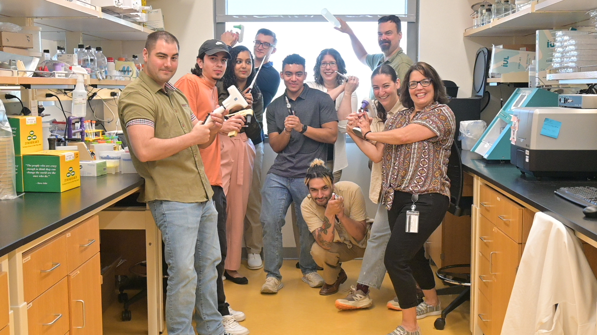

# Namrata-Deka
[Profile](https://medicine.buffalo.edu/phdprogram/about/our-students.host.html/content/shared/smbs/igpbs/profiles/previous-ppbs-students/ndeka.detail.overview.html)
# Hi, I am Namrata Deka
- PhD Candidate in Microbiology and Immunology at the University at Buffalo | Armbruster Lab
- Microbial Genomics | AMR | Bioinformatics | Wet-lab & Computational Biology

  
  > 
  > 
  > 
  
## About Me

I am a microbiologist and bioinformatician focused on understanding microbial evolution and antimicrobial resistance (AMR) in clinical pathogens. I bridge **wet-lab benchwork** with **computational pipelines** to uncover patterns in genomic plasticity, resistance, and host-pathogen dynamics.  

Self-taught in bioinformatics, I love translating raw sequencing data into meaningful insights — whether it is genome assembly, phylogenetics, or metagenomics.

- [AHA predoctoral fellowship](https://medicine.buffalo.edu/news_and_events/news/2024/07/aha-predoctoral-fellowships-20082.html)
-  [Namrata Deka AHA Award details](https://proposalcentral.com/Insights/yK3zgRfRQcI=/Public/AwardDetails/1195538)

---

## Current Focus

- Genome assembly and annotation of *Proteus mirabilis* clinical isolates and gaining phylogenetic insights. 
- Pangenome and antimicrobial resistance (AMR) profiling.
- Comparative genomics of longitudinal urine *P. mirabilis* isolates. 
- Data visualization and exploration using Python (`matplotlib`, `seaborn`) and R (`ggplot2`)  
- Development of reproducible, modular pipelines for microbial comparative genomics  
- Metagenomic profiling of catheterized urine samples using Kraken2 and MetaPhlAn
- Read more on the motivations behind my [PhD project](big_bad_proteus.md)
---

## Tools & Skills

**Languages**: Python, R, Bash  
**Bioinfo Tools**: SPAdes, Prokka, Roary, Kraken2, AMRFinderPlus, RAxML, iTOL, Metaphlan, Kraken2, FastTree, FastQC, MultiQC, ResFinder, CARD,   
**Visualization**: matplotlib, seaborn, ggplot2  
**Workflow**: Conda, Git, GitHub, Jupyter  

---

##  Selected Projects

| Project | Description | Tools |
|--------|-------------|-------|
| [Genome Analysis Pipeline](https://github.com/Deka-nam/genome-analysis-pipeline) | Genomic analysis of *P. mirabilis* isolates from catheterized urine | SPAdes + Prokka + Roary + RAxML + iTol + AMRFinder |
| [Longitudinal Varient Study](https://github.com/Deka-nam/longitudinal-variants) | Varient detection project across longitudinal *P. mirabilis* clinical isolates | Unicycler + Breseq + Python + R |
| [Metagenomic Analysis of Urine](http://github.com/Deka-nam/urine-metagenomics) | Metagenomic analysis of catheterized urine | Kraken2 + SAMtools + MetaPhlan + Python + R |
| [Proteomics Visualization Notebooks](http://github.com/Deka-nam/proteomics-viz)| Best practices for visualizing proteomics data | Python + R |

---

##  Let's Connect

-  [LinkedIn](https://linkedin.com/in/namratadeka)
-  [GitHub](https://github.com/Deka-nam)
-  [Google Scholar](https://scholar.google.com/citations?user=nFb4zb4AAAAJ&hl=en&oi=ao) 
-  Email: ndeka@buffalo.edu

>Learn more: [Why I study *Proteus mirabilis*](big_bad_proteus.md)

> *Built by Namrata Deka — microbial genomics researcher passionate about solving translational questions through NGS, pipelines, and integrative biology.*
