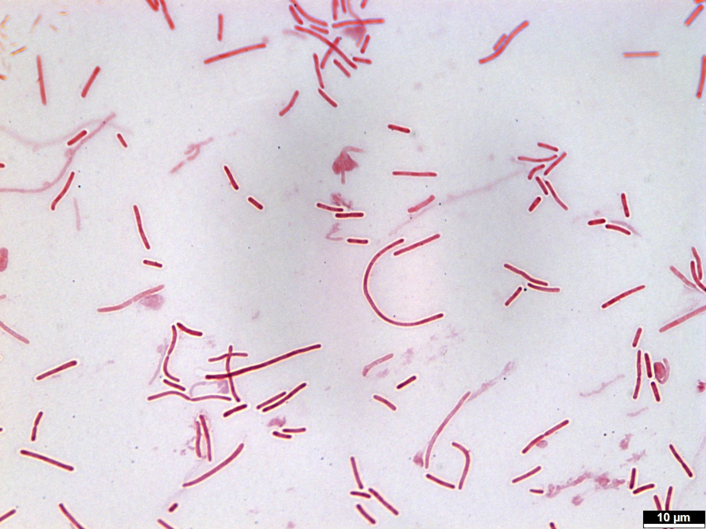

# Why *Proteus mirabilis* Deserves Your Attention
Date: 2025-07-16
> If you are interested to know more about why my PhD project is based on this bacteria, have a read to know the big picture impact. I know we all want to know the pipelines, but what motivated us to build the workflow in the first place? 
Because I am not just a bioinformatician, I am a hybrid scientist. Bench science and dry lab bring out the real fun!
  

##  Wait, What Is *Proteus mirabilis*?

*Proteus mirabilis* is often dismissed as just another urinary tract bug while *E. coli* gets all the fame. But *P. mirabilis* is far from ordinary.  
This little bacterium is:
- A **stone-forming architect** in catheterized patients.
- A **swarming strategist** on agar and inside the host.
- A **resistance chameleon**, evolving under therapeutic pressure.

> 
> 
>
> *Figure 1. Swarming behavior of *P. mirabilis* on agar and under the microscope.* **Fast, coordinated, and beautiful.**

---

## Why We Are Studying It (a.k.a. What Keeps Us Up at Night)

Forget the pipeline for a second. Here is what truly motivates this project:

### 1. **It Turns Urine Into Crystals**

This bug produces urease, which raises the pH of urine and causes **struvite crystals** to form. These crystals:
- Can grow into **kidney stones**
- **Block catheters**
- Create **niches** that are hard to sterilize

> 

>   
>   
>   

>
> *Figure 2. Catheters with crystalline biofilms in the presence of P. mirabilis in Artificial Urine Media (AUM) Credit: Dr. Beryl L. Guterman, PhD.*
> 

---

### 2. **It Evolves Rapidly Over Time**

We are examining **longitudinal isolates** from the same patient over time.  
Why? Because we want to answer:
- How does *P. mirabilis* adapt under **host pressure**?
- How fast does it accumulate **mutations**?
- Are new resistances emerging while it hides in the urinary tract?

> *[AMR genes changing across time]*  
> *Figure 3. Resistance profiles of longitudinal *P. mirabilis* isolates.*

---

### 3. **It Is Sneaky About Antibiotics**

*Proteus* has intrinsic resistance to some antibiotics, and it is picking up more:
- **Beta-lactamases** 
- **Efflux pumps** 
- **Plasmid-borne genes** 

By studying the **pan-genome**, we can spot what is common, what is accessory, and what might be responsible for real-world clinical challenges.

> *[Insert phylogeny or Roary pan-genome plot]*  
> *Figure 4. Genetic diversity among *P. mirabilis* isolates.*

---

## Why It Matters (Outside the Lab)

This is not just science for science’s sake. Understanding *P. mirabilis* helps:
- **Hospitals** design better catheter protocols
- **Clinicians** understand relapse dynamics
- **Biotech** develop next-gen diagnostics and coatings
- **Microbiologists** unravel a model for plasticity, evolution, and persistence

---

## So What’s the Endgame?

We are building a comprehensive genomic map of *P. mirabilis*:
- With **longitudinal time series**
- Across **antibiotic landscapes**
- Covering **gene content**, **mutational changes**, and **clinical relevance**

If we can **predict behavior**, we can **prevent damage**.

Our dream? To move from reactive care to **predictive microbiology**.

---

## Bonus: Some Things You May Not Know

- It swarms so fast it **masks other bugs** in culture.
- It can **survive harsh surfaces** and form crystalline biofilms.
- It is **misidentified** often in labs that skip MALDI or 16S.

## Interpretations of *P. mirabilis*, Illustrated
> 

> 
> 
> 
  
> **It is not just a bug. It is a builder, a breaker, and a survivor.**
> 

---

##  TL;DR

**We are not just sequencing genomes. We are decoding a survival strategy.**

Let us show you how a bug that makes stones is reshaping our understanding of **infection, resistance, and evolution.**

Stay curious,  
[Namrata](README.md) from Team Armbruster
